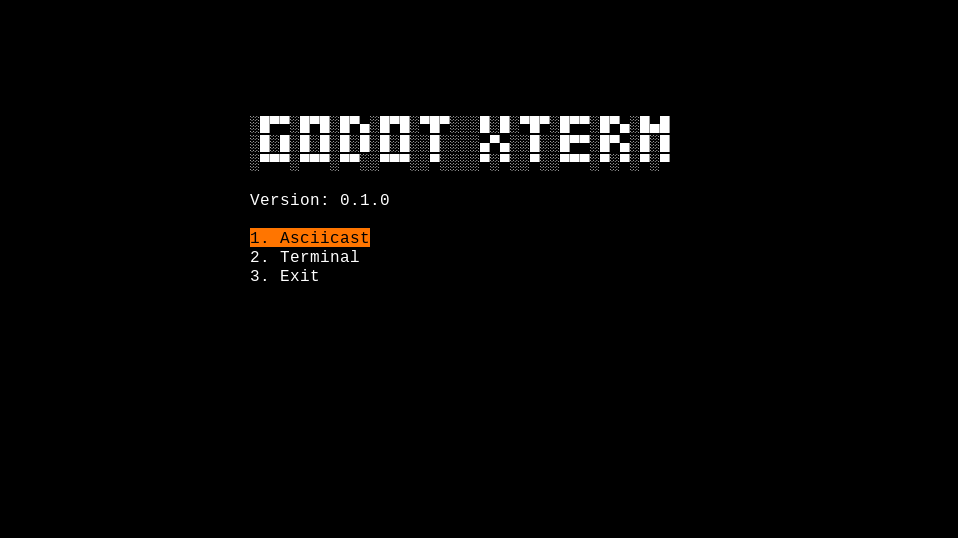

# GodotXterm 


[](https://travis-ci.com/lihop/godot-xterm)

Terminal emulator for Godot using GDNative and [libtsm](https://github.com/Aetf/libtsm).

**Note**: If you are looking for the purely gdscript version of this plugin which was based on Xterm.js, it turned out to be too buggy and slow so is no longer being developed or maintained but can still be found in the [gdscript-unmaintaned](https://github.com/lihop/godot-xterm/tree/gdscript-unmaintained) branch.



## Building

**Important**: It is recommended that you build the native binaries before opening this demo project, otherwise the Godot editor will automatically modify the example scenes when it can't find the native libs, such that they won't work when the files _are_ in place.

If you prefer not to build your own binaries from source, there are some pre-compiled release binaries in the [dist] directory.
They can be copied to the correct location by:
```
cd addons/godot_xterm/native
cp -rf dist/* bin/
```

### All Operating Systems

You will need at least these dependencies in order to build this plugin:
- Git (for git submodules)
- a C++ compiler (e.g. gcc)
- ar (part of GNU Binutils)
- CMake
- Python
- SCons

### Linux

#### NixOS
You can simply run the [build.sh] script in the `addons/godot_xterm/native` directory:
```
addons/godot_xterm/native/build.sh
```
All dependencies will be pulled in by nix-shell and the build steps will run.

#### Arch Linux and Ubuntu
See the [Arch Linux Dockerfile](dockerfiles/archlinux) and [Ubuntu Dockerfile](dockerfiles/ubuntu) for a list of packages that need to be installed. Once installed, run the [build.sh] script in the `addons/godot_xterm/native` directory:
```
addons/godot_xterm/native/build.sh
```

#### Other Linux Distributions
Will probably be similar to the above. When in doubt check the documentation in the submodule repos, the [build.sh] script, and the [SConstruct] file.

### Other Operating Systems
This plugin is not currently supported for other operating systems (e.g. MacOS, Windows). If you manage to build it on one of these platforms, please submit a PR for this readme.

## Usage

- ### [Terminal](addons/godot_xterm/nodes/terminal/README.md)
  The main node provided by this plugin.

- ### [Pseudoterminal](addons/godot_xterm/nodes/pseudoterminal/README.md)
  A node that can be used to connect the Terminal to a shell. Currently Linux only.

  An example of how to use this node with a Terminal can be found in the [terminal scene](examples/terminal).

- ### TPut
  An incomplete helper class based on the [tput](https://invisible-island.net/ncurses/man/tput.1.html) utility.

  Example: On the command line you can use `tput cup 5 5` to position the cursor at row 5 col 5.
  In GDScript this utility can be used to similar effect by doing:
  ```gdscript
  tput.cup(5, 5)
  ```
  Other commands include `tput setaf` to set a foreground color, `tput setab` to set a background color, and many more.
  But only a few of these have been implemented.

  Its usage is demonstrated in the script for the [menu scene](examples/menu). 

- ### Asciicast (.cast) file importer plugin
  [Asciinema](https://asciinema.org) recordings saved with the `.cast` extension will be automatically imported as animations. They can then be added to AnimationPlayer which is a child of a Terminal node. Playing the animation will play the terminal session recording in the parent Terminal.

  See the [asciicast scene](examples/asciicast) for an example.


## Examples
There are three example scenes included in this project which you can study to learn more.
- menu.tscn
- terminal.tscn
- asciicast.tscn

## License

If you contribute code to this project, you are implicitly allowing your code to be distributed under the MIT license.
You are also implicitly verifying that all code is your original work, or unoriginal work which is published under a compatible license or waiver.

Copyright (c) 2020 [The GodotXterm authors](https://github.com/lihop/godot-xterm/graphs/contributors) (MIT License)<br>

The fonts used in this project are published under a seperate license.
See the various license files in the [subdirectories](addons/godot_xterm/themes/fonts/) for each font.


[build.sh]: /addons/godot_xterm/native/build.sh
[dist]: /addons/godot_xterm/native/dist
[SConstruct]: /addons/godot_xterm/native/SConstruct
