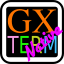
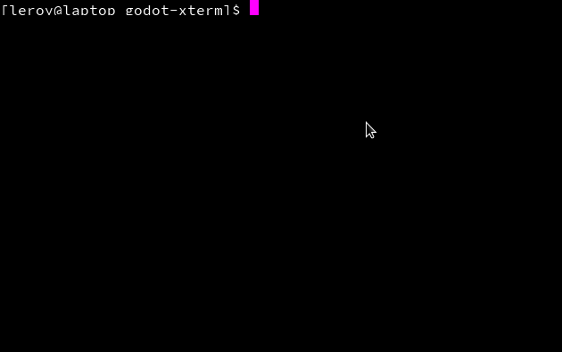

# GodotXterm 

Xterm for Godot.
This is still very much a work in progress.
Most of the credit goes to the authors of [xterm.js](https://github.com/xtermjs/xterm.js) as most of this code was taken from that project and translated to GDScript.

## Demo

If you are running Linux and have `which`, `bash` and `socat` installed you can run the main scene (`demo.tscn`) and it will try 
to connect the Terminal node to your system.

Otherwise you can check out the gif below:

## Testing

This project uses the awesome [Gut](https://github.com/bitwes/Gut) (Godot Unit Testing) plugin for testing.
You can run the tests by playing the test scene at `res://test/test.tscn` and clicking run.

## License

If you contribute code to this project, you are implicitly allowing your code to be distributed under the MIT license.
You are also implicitly verifying that all code is your original work, or unoriginal work which is published under a compatible license or waiver.

Copyright (c) 2020, [The GodotXterm authors](https://github.com/lihop/godot-xterm/graphs/contributors) (MIT License) 
Copyright (c) 2017-2019, [The xterm.js authors](https://github.com/xtermjs/xterm.js/graphs/contributors) (MIT License) 
Copyright (c) 2014-2017, SourceLair, Private Company ([www.sourcelair.com](https://www.sourcelair.com/home)) (MIT License) 
Copyright (c) 2012-2013, Christopher Jeffrey (MIT License)
