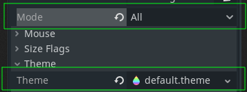
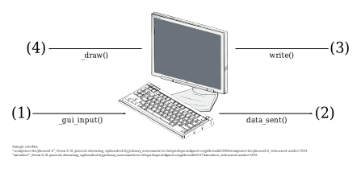

# Terminal

**Inherits:** [Control] < [CanvasItem] < [Node] < [Object]


Terminal emulator.

**IMPORTANT:**



- If the terminal isn't responding to keyboard or mouse input check that `focus_mode` is set to `All`, otherwise `_gui_input()` won't be called so no input will be processed.
- If you want to customize the colors and font of the terminal, be sure to set the theme property. A default theme that can be found in the [themes directory](../../themes) and can be used as a template for creating a custom theme.


## Description



### (1) User Input

The user enters some data into the terminal, typically by typing something on the keyboard or clicking (and possibly dragging) somewhere on the screen.
This corresponds to the `_gui_input()` method which is implemented in [terminal.cpp](./terminal.cpp).

### (2) Terminal Output

The user input from (1) is processed by the terminal and converted.
For example, if the user were to press the downwards arrow key (↓), the terminal would interpret this
and the `data_sent()` signal would be emitted with the value `"\u001b[A"`.
For a full list of escape sequences see ["XTerm Control Sequences"](https://invisible-island.net/xterm/ctlseqs/ctlseqs.html).

### (3) Terminal Input

In the other direction, characters can be sent to the terminal. This corresponds to the `write()` method.

### (4) Draw

The input from (3) is then intepreted by the terminal and drawn to the screen.
For example if the string "\u001b[38;2;0;255;0;mA" was written to the terminal, then it would draw a green colored capital letter 'A' on the screen.

## Properties

| Type  | Name | Default |
|-------|------|---------|
| [int] | rows | 24      |
| [int] | cols | 80      |

## Methods

| Returns | Signature                                       |
|---------|-------------------------------------------------|
| void    | write **(** [String]\|[PoolByteArray] data **)** |


## Theme Properties

| Type    | Name                          | Default                      |
|---------|-------------------------------|------------------------------|
| [Color] | Terminal/colors/Background    | Color(0.0, 0.0, 0.0, 1.0)    |
| [Color] | Terminal/colors/Black         | Color(0.0, 0.0, 0.0, 1.0)    |
| [Color] | Terminal/colors/Blue          | Color(0.0, 0.0, 0.5, 1.0)    |
| [Color] | Terminal/colors/Cyan          | Color(0.0, 0.5, 0.5, 1.0)    |
| [Color] | Terminal/colors/Dark Grey     | Color(0.5, 0.5, 0.5, 1.0)    |
| [Color] | Terminal/colors/Foreground    | Color(1.0, 1.0, 1.0, 1.0)    |
| [Color] | Terminal/colors/Green         | Color(0.0, 0.5, 0.0, 1.0)    |
| [Color] | Terminal/colors/Light Blue    | Color(0.0, 0.0, 1.0, 1.0)    |
| [Color] | Terminal/colors/Light Cyan    | Color(0.0, 1.0, 1.0, 1.0)    |
| [Color] | Terminal/colors/Light Green   | Color(0.0, 1.0, 0.0, 1.0)    |
| [Color] | Terminal/colors/Light Grey    | Color(0.75, 0.75, 0.75, 1.0) |
| [Color] | Terminal/colors/Light Magenta | Color(1.0, 0.0, 1.0, 1.0)    |
| [Color] | Terminal/colors/Light Red     | Color(1.0, 0.0, 0.0, 1.0)    |
| [Color] | Terminal/colors/Light Yellow  | Color(1.0, 1.0, 0.0, 1.0)    |
| [Color] | Terminal/colors/Magenta       | Color(0.5, 0.0, 0.5, 1.0)    |
| [Color] | Terminal/colors/Red           | Color(0.5, 0.0, 0.0, 1.0)    |
| [Color] | Terminal/colors/White         | Color(1.0, 1.0, 1.0, 1.0)    |
| [Color] | Terminal/colors/Yellow        | Color(0.5, 0.5, 0.0, 1.0)    |
| [Font]  | Terminal/fonts/Bold           |                              |
| [Font]  | Terminal/fonts/Bold Italic    |                              |
| [Font]  | Terminal/fonts/Italic         |                              |
| [Font]  | Terminal/fonts/Regular        |                              |

## Signals

- **data_sent** **(** [PoolByteArray] data **)**

  Emitted when some data comes out of the terminal.
  This typically occurs when the user interacts with the terminal by typing on the keyboard or clicking somewhere.
  Input can be interpreted differently depending on modifier keys and the terminal's settings/state.

  In a typical setup, this data would be forwarded to the pseudoterminal.

---

- **key_pressed** **(** [String] data, [InputEventKey] event **)**

  Emitted when a key is pressed. `data` is the data that would be emitted by the terminal via the `data_sent()` signal and may vary based on the terminal's state. `event` is the event captured by Godot in the `_gui_input(event)` method.

---

- **size_changed** **(** [Vector2] new_size **)**

  Emitted when the terminal's size changes, typically in response to its `rect_size` changing. 
  `new_size.x` will be the number of columns and `new_size.y` will be the number of rows.
  This information should be forwarded to a pseudoterminal if it is connected so that it can update its size accordingly.

## Property Descriptions

- [int] **rows**

  |           |      |
  |-----------|------|
  | *Default* | 24   |
  | *Setter*  | None |
  | *Getter*  | None | 
  
  The number of rows in the terminal's rect.
  When using a monospace font, this is typically the number of characters that can fit from the top to the bottom.
  It will automatically update as the Control's rect_size changes, and therefore shouldn't be used to set the size of the terminal directly.

---

- [int] **cols**

  |           |      |
  |-----------|------|
  | *Default* | 80   |
  | *Setter*  | None |
  | *Getter*  | None | 
  
  The number of columns in the terminal's rect.
  When using a monospace font, this is typically the number of characters that can fit from one side to another.
  It will automatically update as the Control's rect_size changes, and therefore shouldn't be used to set the size of the terminal directly.


## Method Descriptions

- void **write** **(** [String]|[PoolByteArray] data **)**

  Writes data to the terminal emulator. Accepts either a [String] or [PoolByteArray].
  Typically it would be connected to the output of a pseudoterminal.

  Example:
  ```gdscript
  $Terminal.write("Hello World")
  $Terminal.write("Hello World".to_utf8())
  $Terminal.write(PoolByteArray([0x1b, 0x9e])
  ```

[CanvasItem]: https://docs.godotengine.org/en/stable/classes/class_canvasitem.html
[Color]: https://docs.godotengine.org/en/stable/classes/class_color.html
[Control]: https://docs.godotengine.org/en/stable/classes/class_control.html
[Node]: https://docs.godotengine.org/en/stable/classes/class_node.html
[Font]: https://docs.godotengine.org/en/stable/classes/class_font.html
[InputEventKey]: https://docs.godotengine.org/en/stable/classes/class_inputeventkey.html
[int]: https://docs.godotengine.org/en/stable/classes/class_int.html
[Object]: https://docs.godotengine.org/en/stable/classes/class_object.html
[PoolByteArray]: https://docs.godotengine.org/en/stable/classes/class_poolbytearray.html
[String]: https://docs.godotengine.org/en/stable/classes/class_string.html
[Vector2]: https://docs.godotengine.org/en/stable/classes/class_vector2.html
