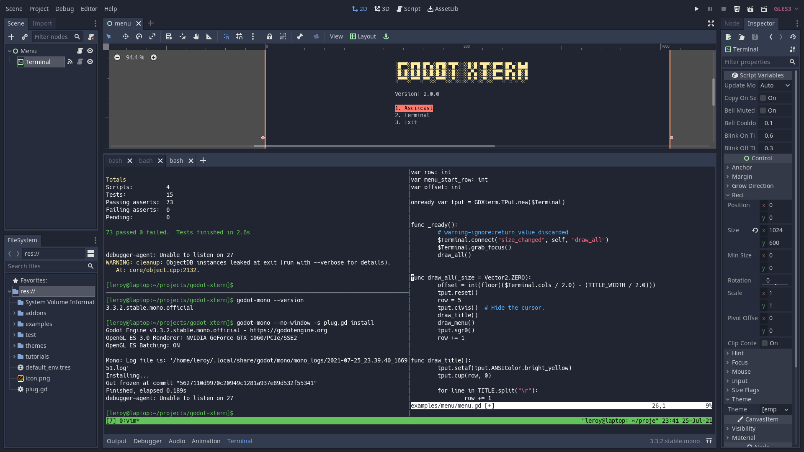

# Features

- ### [Terminal](/getting_started/terminal_node.md)

  A VT100/xterm-compatible Terminal emulator Control node.

  Supports ANSI and XTerm escape sequences for screen manipulation, cursor movement, text styling, and terminal effects. Can be used standalone for displaying terminal output, or connected to a PTY node to create a fully functional terminal emulator.

- ### [PTY](/getting_started/pty_node.md)

  Spawns and controls real system processes with pseudoterminal file descriptors, enabling bidirectional communication with shells, interpreters, and command-line programs. Can be used standalone, or connected to a Terminal node to create a fully functional shell interface within your Godot application.

- ### [Integrated terminal](/tutorials/integrated_terminal.md)

  

  Provides a built-in terminal panel in the Godot Editor, similar to VSCode’s integrated terminal or IntelliJ’s embedded terminal.
  Allows you to run shell commands, build scripts, version control operations, and other terminal tasks without leaving the editor.

- ### [Asciicast import](/tutorials/import_plugins.md#asciicast)

  Imports terminal session recordings from asciinema (`.cast` files) as Godot animations that replay the exact timing and output of recorded terminal sessions.

- ### [X resources import](/tutorials/import_plugins.md#x-resources)

  Automatically converts X11 terminal color scheme files (`.xrdb`, `.Xresources`) into Godot Theme resources for instant terminal styling.
