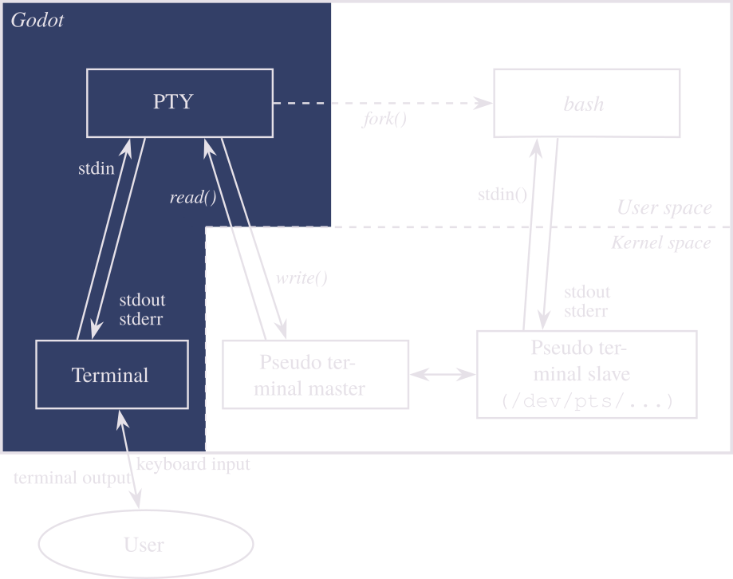

# PTY

**Inherits:** [Node] < [Object]

*Linux and macOS only.*

Node for forking processes (e.g. bash, nodejs, python) with pseudoterminal file descriptors.
Can be used with the [Terminal] node to get an actual shell.

Not currently supported on Windows, but it could be in the future using [ConPTY](https://docs.microsoft.com/en-us/windows/console) or [WinPTY](https://github.com/rprichard/winpty).
See issue [\#25](https://github.com/lihop/godot-xterm/issues/25).

## Overview

"PTY Diagram" is a derivative of [Termios-script-diagram.svg](https://commons.wikimedia.org/wiki/File:Termios-script-diagram.svg) by [Krishnavedala](https://en.wikipedia.org/wiki/User:Krishnavedala?rdfrom=commons:User:Krishnavedala), used under [CC0](https://creativecommons.org/share-your-work/public-domain/cc0/).

## Properties

| Type         | Name                                 | Default                                                |
|--------------|--------------------------------------|--------------------------------------------------------|
| [NodePath]   | [terminal_path](#prop-terminal_path) | None                                                   |
| [int]        | [cols](#prop-cols)                   | `80`                                                   |
| [int]        | [rows](#prop-rows)                   | `24`                                                   |
| [Dictionary] | [env](#prop-env)                     | `{ COLORTERM = "truecolor", TERM = "xterm-256color" }` |
| [bool]       | [use_os_env](#prop-use_os_env)       | `true`                                                 |

## Methods

| Returns | Signature                                                                                                                           |
|---------|-------------------------------------------------------------------------------------------------------------------------------------|
| [Error] | [fork](#mthd-fork) **(** [String] file=`$SHELL`, [PoolStringArray] args=[], [String] cwd=`$PWD`, [int] cols=80, [int] rows=24 **)** |
| void    | [kill](#mthd-kill) **(** [int] signum **)**                                                                                         |
| [Error] | [open](#mthd-open) **(** [int] cols=80, [int] rows=24 **)**                                                                         |
| void    | [resize](#mthd-resize) **(** [int] cols, [int] rows **)** 	                                                                        |
| void    | [resizev](#mthd-resizev) **(** [Vector2] size **)**                                                                                 |
| void    | [write](#mthd-write) **(** [String]\|[PoolByteArray] data **)**                                                                     |

## Signals

- <a name="sgnl-data_received" /> **data_received** **(** [PoolByteArray] data **)**

  Emitted when data is read from the pseudoterminal master device.

---

- <a name="sgnl-exited" /> **exited** **(** [int] exit_code, [int] signum **)**

  Emitted when the child program exits. `exit_code` is the exit status of the child program and `signum` is the number of the signal that terminated the child program.

## Enumerations

### <a name="enum-signal" /> enum **Signal**:

- **SIGHUP** = 1 --- Hangup.
- **SIGINT** = 2 --- Terminal interrupt signal.
- **SIGQUIT** = 3 --- Terminal quit signal.
- **SIGILL** = 4 --- Illegal instruction.
- **SIGTRAP** = 5 --- Trace/breakpoint trap.
- **SIGABRT** = 6 --- Process abort signal.
- **SIGFPE** = 8 --- Erroneous arithmetic operation.
- **SIGKILL** = 9 --- Kill (cannot be caught or ignored).
- **SIGSEGV** = 11 --- Invalid memory reference.
- **SIGPIPE** = 13 --- Write on a pipe with no one to read it.
- **SIGALRM** = 14 --- Alarm clock.
- **SIGTERM** = 15 --- Termination signal.

## Property Descriptions

### <a name="prop-terminal_path" /> [NodePath] **terminal_path**

  |           |                          |
  |-----------|--------------------------|
  | *Default* | None                     |
  | *Setter*  | set_terminal_path(value) |
  | *Getter*  | None                     |

  [NodePath] to a [Terminal]. Setting this path will automatically connect the appropriate signals of both nodes for standard operation. It will also disconnected the signals of the previously set terminal, if any.

---

- <a name="prop-cols" /> [int] **cols**

  |           |                          |
  |-----------|--------------------------|
  | *Default* | `80`                     |
  | *Setter*  | set_cols(value)          |
  | *Getter*  | None                     |

  The column size in characters.

---

- <a name="prop-rows" /> [int] **rows**

  |           |                          |
  |-----------|--------------------------|
  | *Default* | `24`                     |
  | *Setter*  | set_rows(value)          |
  | *Getter*  | None                     |

  The row size in characters.

---

- <a name="prop-env" /> [Dictionary] **env**

  |           |                                                        |
  |-----------|--------------------------------------------------------|
  | *Default* | `{ COLORTERM = "truecolor", TERM = "xterm-256color" }` |
  | *Setter*  | None                                                   |
  | *Getter*  | None                                                   |

  Environment variables to be set for the child program.

---

- <a name="prop-use_os_env" /> [bool] **use_os_env**

  |           |        |
  |-----------|--------|
  | *Default* | `true` |
  | *Setter*  | None   |
  | *Getter*  | None   |

  If `true` the environment variables from `env` will be merged with the environment variables of the current program (i.e. Godot), with the variables from `env` taking precedence over the environment variables of the current program.

## Method Descriptions

- <a name="mthd-fork" /> [Error] **fork** **(** [String] file=`$SHELL`, [PoolStringArray] args=[], [String] cwd=`$PWD`, [int] cols=80, [int] rows=24 **)**

  Opens a pseudoterminal and starts a new process using the program specified by `file`.
  `file` defaults to the value of the `SHELL` environment variable, falling back to `sh`.
  The arguments specified in `args` are passed to the program.
  `cwd` is the directory in which the program will be executed. Defaults to the working directory of the current program (typically the project directory, when running from editor).
  `cols` is the initial number of columns and `rows` is the initial number of rows.
  Returns [OK] if successful.

  See also Godot's [OS.execute()](https://docs.godotengine.org/en/stable/classes/class_os.html#class-os-method-execute) method.

---

- <a name="mthd-kill" /> void **kill** **(** [int] signum=1 **)**

  Sends the specified signal (`signum`) to the PTY's child process, if any. Defaults to 1 (SIGHUP).

  See also Godot's [OS.kill()](https://docs.godotengine.org/en/stable/classes/class_os.html#class-os-method-kill) method.

---

- <a name="mthd-open" /> [Error] **open** **(** [int] cols=80, [int] rows=24 **)**

  Opens a pseudoterminal but does not start any process. Returns [OK] if successful.

---

- <a name="mthd-resize" /> void **resize** **(** [int] cols, [int] rows **)**

  Resizes the dimensions of the pseudoterminal.

---

- <a name="mthd-resizev" /> void **resizev** **(** [Vector2] size **)**

  Same as resize, but accepts a [Vector2] where `x` is cols and `y` is rows.

---

- <a name="mthd-write" /> void **write** **(** [String] \| [PoolByteArray] data **)**

  Writes data to the pseudoterminal master device.

[Dictionary]: https://docs.godotengine.org/en/stable/classes/class_dictionary.html
[Error]: https://docs.godotengine.org/en/stable/classes/class_%40globalscope.html#enum-globalscope-error
[Node]: https://docs.godotengine.org/en/stable/classes/class_node.html
[NodePath]: https://docs.godotengine.org/en/stable/classes/class_nodepath.html
[Object]: https://docs.godotengine.org/en/stable/classes/class_object.html
[OK]: https://docs.godotengine.org/en/stable/classes/class_%40globalscope.html#class-globalscope-constant-ok
[PoolByteArray]: https://docs.godotengine.org/en/stable/classes/class_poolbytearray.html
[PoolStringArray]: https://docs.godotengine.org/en/stable/classes/class_poolstringarray.html
[String]: https://docs.godotengine.org/en/stable/classes/class_string.html
[Terminal]: /api/terminal
[Vector2]: https://docs.godotengine.org/en/stable/classes/class_vector2.html
[bool]: https://docs.godotengine.org/en/stable/classes/class_bool.html
[int]: https://docs.godotengine.org/en/stable/classes/class_int.html
