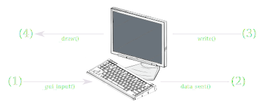

# Terminal

**Inherits:** [Control] < [CanvasItem] < [Node] < [Object]

A Terminal emulator Control node. 

Supports ANSI and (some) XTerm Control Sequences which can be used to do things such as clear the screen, move the cursor, change printed text color, ring a bell, and so on.
For an exhaustive list of terminal control sequences (not all of which are supported by GodotXterm) see ["XTerm Control Sequences"](https://invisible-island.net/xterm/ctlseqs/ctlseqs.html).


## Overview 

<sub>"Terminal Flow Diagram" is a derivative of ["computer keyboard 2"](https://openclipart.org/detail/2396/computer-keyboard-2) and ["monitor"](https://openclipart.org/detail/1637/monitor), from U.S. patent drawings, uploaded by [johnny_automatic](https://openclipart.org/artist/johnny_automatic), used under [CC0](https://creativecommons.org/share-your-work/public-domain/cc0/).<sub/>

### (1) User Input

The user enters some data into the terminal, typically by typing something on the keyboard.
This corresponds to the `_gui_input()` method.

### (2) Terminal Output

The user input from (1) is processed by the terminal state machine and converted to the appropriate output.
For example, if the user were to press the downwards arrow key (↓), the terminal would then emit `data_sent()`
with the value `"\u001b[A"`.

### (3) Terminal Input

In the other direction, data can be sent to the terminal. This corresponds to the `write()` method.

### (4) Draw

The input from (3) is then interpreted by the terminal state machine and drawn to the screen.
For example if the string `"\u001b[38;2;0;255;0;mA"` was written to the terminal, then it would draw a green colored capital letter 'A' on the screen.


## Properties

| Type         | Name                                 | Default |
|--------------|--------------------------------------|---------|
| [bool]       | [bell_muted](#prop-bell_muted)       | `false` |
| [float]      | [bell_cooldown](#prop-bell_cooldown) | `0.1`   |
| [int]        | [cols](#prop-cols)                   | `2`     |
| [int]        | [rows](#prop-rows)                   | `2`     |
| [UpdateMode] | [update_mode](#prop-update_mode)     | `AUTO`  |


## Methods

| Returns  | Signature                                                       |
|----------|-----------------------------------------------------------------|
| void     | [clear](#mthd-clear) **()**                                     |
| [String] | [copy_all](#mthd-copy_all) **()**                               |
| [String] | [copy_selection](#mthd-copy_selection) **()**                   |
| void     | [write](#mthd-write) **(** [String]\|[PoolByteArray] data **)** |


## Signals

- <a name="sgnl-bell" /> **bell** **()**

  Emitted when the [bell character](https://en.wikipedia.org/wiki/Bell_character) (`"\u0007"`) is written to the terminal.

---

- <a name="sgnl-data_sent" /> **data_sent** **(** [PoolByteArray] data **)**

  Emitted when some data comes out of the terminal.
  This typically occurs when the user interacts with the terminal by typing on the keyboard.
  Input can be interpreted differently depending on modifier keys and the terminal's settings/state.

  When connected to a [PTY], this data will be forwarded to it.

---

- <a name="sgnl-key_pressed" /> **key_pressed** **(** [String] data, [InputEventKey] event **)**

  Emitted when a key is pressed. `data` is the data that would be emitted by the terminal via the [`data_sent()`](#sgnl-data_sent) signal and may vary based on the terminal's state. `event` is the event captured by Godot in the `_gui_input(event)` method.

---

- <a name="sgnl-size_changed"> **size_changed** **(** [Vector2] new_size **)**

  Emitted when the terminal's size changes, typically in response to its `rect_size` changing. 
  `new_size.x` will be the number of columns and `new_size.y` will be the number of rows.
  This information should be forwarded to a pseudoterminal, if it is connected, so that it can update its size accordingly.


## Enumerations

<a name="enum-update_mode" /> enum **UpdateMode**:

- **DISABLED**       = **0** --- The terminal's `update()` method will never be called. No new cells will be drawn.
- **AUTO**           = **1** --- Only changed cells will be drawn after `update()` is called, but will switch to **ALL_NEXT_FRAME** when mass redraws are required.
- **ALL**            = **2** --- Every cell will be drawn on every `update()` call.
- **ALL_NEXT_FRAME** = **3** --- Draws every cell afetr the next `update()` call, then returns to **AUTO**.


## Property Descriptions

- <a name="prop-rows" /> [int] **rows**

  |           |            |
  |-----------|------------|
  | *Default* | `2`        |
  | *Setter*  | None       |
  | *Getter*  | None       | 
  
  The number of rows in the terminal's rect.
  When using a monospace font, this is typically the number of characters that can fit from the top to the bottom.
  It will automatically update as the Control's rect_size changes, and therefore shouldn't be used to set the size of the terminal directly.

---

- <a name="prop-cols" /> [int] **cols**

  |           |            |
  |-----------|------------|
  | *Default* | `2`        |
  | *Setter*  | None       |
  | *Getter*  | None       | 
  
  The number of columns in the terminal's rect.
  When using a monospace font, this is typically the number of characters that can fit from one side to another.
  It will automatically update as the Control's rect_size changes, and therefore shouldn't be used to set the size of the terminal directly.

---

- <a name="prop-bell_muted" /> [bool] **bell_muted**

  |           |         |
  |-----------|---------|
  | *Default* | `false` |
  | *Setter*  | None    |
  | *Getter*  | None    | 

  If muted, no [`bell`](#sgnl-bell) signal will be emitted when the bell character (`"\u0007"`) is written to the terminal.

---

- <a name="prop-bell_cooldown" /> [float] **bell_cooldown**

  |           |       |
  |-----------|-------|
  | *Default* | `0.1` |
  | *Setter*  | None  |
  | *Getter*  | None  |

  The minimum amount of time to wait before emitting another [`bell`](#sgnl-bell) signal on subsequent writes of the bell character.
  Writing the bell character too frequently, for example by running the command `while true; do echo -e "\a"; done`,
  can have a negative impact on performance depending on how the signal is connected.
  This property allows throttling of that signal.

---

- <a name="prop-update_mode" /> [UpdateMode] **update_mode**

  |           |                        |
  |-----------|------------------------|
  | *Default* | `AUTO`                 |
  | *Setter*  | set_update_mode(value) |
  | *Getter*  | None                   |

  Determines which cells of the terminal will be updated when its state changes.
  By default `AUTO` will only update cells that changed, but will update all cells (i.e. the entire screen) on major changes,
  such as terminal resize.
  If you are having trouble with the terminal not updating correctly or exhibiting artifacts, you can try remedying this by setting `update_mode` to `ALL`, however, this will have a negative impact on performance.


## Method Descriptions

- <a name="mthd-clear" /> void **clear** **()**

  Removes all but the bottommost row of the terminal including scrollback buffer.

---

- <a name="mthd-copy_all" /> [String] **copy_all** **()**

  Copies all of the text in the terminal including scrollback buffer.

---

- <a name="mthd-copy_selection" /> [String] **copy_selection** **()**

  Copies only selected (i.e. highlighted) text in the terminal.
  Will return an empty string if nothing is highligted.

---

- <a name="mthd-write" /> void **write** **(** [String] \| [PoolByteArray] data **)**

  Writes data to the terminal emulator. Accepts either a [String] or [PoolByteArray].
  Typically it would be connected to the output of a [PTY]'s [`data_received()`](/api/pty#sgnl-data_received) signal.

  Example:
  ```gdscript
  $Terminal.write("Hello World")
  $Terminal.write("Hello World".to_utf8())
  $Terminal.write(PoolByteArray([0x1b, 0x9e])
  ```

[AudioStream]: https://docs.godotengine.org/en/stable/classes/class_audiostream.html
[CanvasItem]: https://docs.godotengine.org/en/stable/classes/class_canvasitem.html
[Color]: https://docs.godotengine.org/en/stable/classes/class_color.html
[Control]: https://docs.godotengine.org/en/stable/classes/class_control.html
[Font]: https://docs.godotengine.org/en/stable/classes/class_font.html
[InputEventKey]: https://docs.godotengine.org/en/stable/classes/class_inputeventkey.html
[Node]: https://docs.godotengine.org/en/stable/classes/class_node.html
[Object]: https://docs.godotengine.org/en/stable/classes/class_object.html
[PoolByteArray]: https://docs.godotengine.org/en/stable/classes/class_poolbytearray.html
[PTY]: /api/pty
[String]: https://docs.godotengine.org/en/stable/classes/class_string.html
[UpdateMode]: #enum-update_mode
[Vector2]: https://docs.godotengine.org/en/stable/classes/class_vector2.html
[bool]: https://docs.godotengine.org/en/stable/classes/class_bool.html
[float]: https://docs.godotengine.org/en/stable/classes/class_float.html
[int]: https://docs.godotengine.org/en/stable/classes/class_int.html
