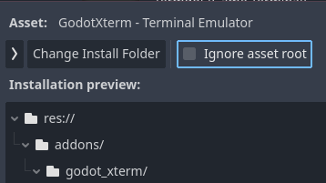

# Installation

Installing GodotXterm means getting the files from `addons/godot_xterm` into your Godot project and ensuring the GDExtension binary files are in place at `addons/godot_xterm/lib` for your target platforms.

:::{note}
If you want to customize the GDExtension you will need to compile the C/C++ code from source. See [Building from source](../development/building_from_source.md) for information on how to do this.
:::

## Get the files

There are several ways to get the files:

### Godot Asset Library

The easiest way to install GodotXterm is from the official [Godot Asset Library](https://godotengine.org/asset-library/asset/4301).

1. Open your Godot project.
2. Go to the **AssetLib** tab at the top of the editor.

```{note}
If this is your first time using the Asset Library, click **Go Online** to connect.
```

3. Search for "GodotXterm" (or "terminal" to see GodotXterm along with a range of other terminal addons).
4. Click on the GodotXterm result and then **Download**.
5. In the installation dialog, make sure to uncheck "Ignore asset root" so the addon is installed under `addons/godot_xterm`.



6. Click **Install** and **OK** to complete the installation.

The addon files (along with GDExtension binaries) will be automatically placed in your project's `addons/godot_xterm` directory.

### Manual

1. Download the latest `godot-xterm-v<version>.zip` file from the **Assets** section of [the Releases page](https://github.com/lihop/godot-xterm/releases)
   for the release you wish to install.

   ```{tip}
   See the [CHANGELOG](../about/changelog.md) for information about what's new, changed, and fixed in each release.
   ```

2. Extract the zip file to your Godot project root directory (where your `project.godot` file is located).
   This will create an `addons/godot_xterm` directory in your project with all the necessary files.

   **Linux/macOS:**

   ```bash
   unzip godot-xterm-v4.0.0.zip -d /path/to/your/project
   ```

   **Windows:** Right-click the zip file and select "Extract All", then choose your project folder.

### Gd-plug

Older versions of this addon could be installed using [gd-plug](https://github.com/imjp94/gd-plug) as the binaries were committed directly to the [godot-xterm-dist](https://github.com/lihop/godot-xterm-dist) distribution repo. Newer releases have moved to CI-generated release assets to simplify the build and distribution process without maintaining a separate binary repo.

In the future, it may be possible to install using gd-plug using the release asset zip file URL. There is [a PR](https://github.com/imjp94/gd-plug/pull/46) to add zip support, and a modified version of `plug.gd` based on this might work with current releases.

## Enable the plugin

:::{note}
This step is optional. If you only need the [Terminal](../classes/class_terminal.rst) and [PTY](../classes/class_pty.rst) nodes in your scenes, you can skip enabling the plugin. Plugin enablement is only required for the [integrated terminal](../tutorials/integrated_terminal.md) and [import plugins](../tutorials/import_plugins.md).
:::

1. Open the plugin settings by going to **Project > Project Settings > Plugins**.
2. Check the box next to "GodotXterm".


