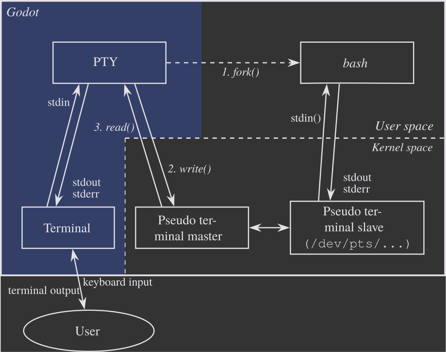
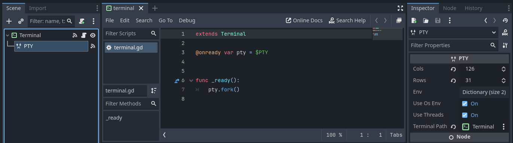

# PTY node

A PTY (pseudoterminal) spawns and controls actual shell processes like bash, cmd, or any command-line program. Unlike {{ '[OS.execute()]({}/classes/class_os.html#class-os-method-execute)'.format(godot_docs) }}, which runs a command and gives you the final output, PTY gives you real-time streaming output and lets you send input while the process runs.

```{note}
PTY is supported on Linux, macOS, and Windows, but not Web. Windows support uses [ConPTY](https://docs.microsoft.com/en-us/windows/console) which requires Windows 10 version 1903 (May 2019) or later.
```

## Overview


<small>_"PTY Diagram" is a derivative of [Termios-script-diagram.svg](https://commons.wikimedia.org/wiki/File:Termios-script-diagram.svg) by [Krishnavedala](https://en.wikipedia.org/wiki/User:Krishnavedala?rdfrom=commons:User:Krishnavedala), used under [CC0](https://creativecommons.org/share-your-work/public-domain/cc0/)._</small>

1. **Fork a process**

   When [fork()](../classes/class_pty.rst#class-pty-method-fork) is called, the PTY creates a new shell process (for example `bash` in the diagram above).
   The OS also creates a pseudoterminal pair: a master side (connected to PTY) and a slave side (connected to the shell).
   The shell process treats the slave side as a real terminal.

2. **Write input**

   Data is sent via [write()](../classes/class_pty.rst#class-pty-method-write) (e.g., `pty.write("ls -al\n")`). This travels from PTY → pseudoterminal master → pseudoterminal slave → shell process.
   The shell receives the command as if it were typed on a keyboard.

3. **Read output**

   The shell executes the command and writes output to its "terminal" (the slave side).
   This flows back: shell → pseudoterminal slave → pseudoterminal master → PTY.
   The [data_received](../classes/class_pty.rst#class-pty-signal-data-received) signal fires with the output data.

4. **Ongoing communication**

   Steps (2) and (3) repeat for the lifetime of the process.
   Commands can be sent, output received, and special signals like `ETX` ({kbd}`Ctrl + C`) can be sent to interrupt running programs.

## Basic usage

PTY can be used to run one-off commands. Output will be emitted via the [data_received](../classes/class_pty.rst#class-pty-signal-data-received) signal. When the command completes, PTY emits the [exited](../classes/class_pty.rst#class-pty-signal-exited) signal with the exit code.

```gdscript
extends Node

@onready var pty = $PTY

func _ready():
    # Connect to signals
    pty.data_received.connect(_on_output)
    pty.exited.connect(_on_exit)

    # Run a simple command
    var result = pty.fork("ls", ["-la"])
    if result != OK:
        print("Failed to run command: ", result)

func _on_output(data: PackedByteArray):
    var output = data.get_string_from_utf8()
    print("Command output: ", output)

func _on_exit(exit_code: int, signal_code: int):
    print("Command finished with exit code: ", exit_code)
```

For long-running programs that produce continuous output, PTY provides real-time streaming.
The [kill](../classes/class_pty.rst#class-pty-method-kill) method can be used to control or terminate the running process.

```gdscript
extends Node

@onready var pty = $PTY

func _ready():
    # Connect to signals
    pty.data_received.connect(_on_output)
    pty.exited.connect(_on_exit)

    # Start ping
    var result = pty.fork("ping", ["google.com"])
    if result != OK:
        print("Failed to start ping: ", result)
        return

    # Stop ping after 10 seconds
    await get_tree().create_timer(10.0).timeout
    print("Stopping ping...")
    pty.kill(2) # Send SIGINT to stop the process

func _on_output(data: PackedByteArray):
    var output = data.get_string_from_utf8()
    print("Shell output: ", output)

func _on_exit(exit_code: int, signal_code: int):
    print("Shell exited with code: ", exit_code)
```

## Connecting a Terminal

To create a fully functional terminal, connect the PTY to a Terminal node:

1. Add a **Terminal** node to your scene.
2. Add a **PTY** node to your scene.
3. In the PTY's inspector, set the **Terminal Path** property to point to the Terminal node (e.g., `"."` if PTY is a child of the Terminal).
4. Fork a process in code.



```gdscript
extends Terminal

@onready var pty = $PTY

func _ready():
    # terminal_path is already set in inspector to connect signals automatically

    # Fork a shell process
    var result = pty.fork()
    if result != OK:
        print("Failed to start shell: ", result)
```

```{note}
If no args are provided to `fork()`, then PTY will default to using the program specified by the `SHELL` environment variable.
If this environment variable is not set, then it will fall back to `sh` on Linux and macOS, and `powershell` on Windows.
```

## Next steps

- Explore the complete [PTY class reference](../classes/class_pty.rst) for advanced features.
