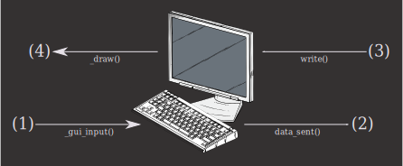

# Terminal node

The Terminal node provides a visual terminal emulator that can display text, handle ANSI escape sequences, and process user input. You can use it standalone for displaying terminal output or connect it to a PTY for full terminal functionality.

## Overview


<small>_"Terminal Flow Diagram" is a derivative of ["computer keyboard 2"](https://openclipart.org/detail/2396/computer-keyboard-2) and ["monitor"](https://openclipart.org/detail/1637/monitor), from U.S. patent drawings, uploaded by [johnny_automatic](https://openclipart.org/artist/johnny_automatic), used under [CC0](https://creativecommons.org/share-your-work/public-domain/cc0/)._</small>

1. **User input**

   The user enters some data into the terminal, typically by typing something on the keyboard.

2. **Terminal output**

   The user input from (1) is processed by the terminal state machine and converted to the appropriate output.
   For example, if the user were to press the downward arrow key ({kbd}`↓`), the terminal would then emit `data_sent()` with the value `"\u001b[B"`.

3. **Terminal input**

   In the other direction, data can be sent to the terminal. This corresponds to the `write()` method.

4. **Draw**

   The input from (3) is then interpreted by the terminal state machine and drawn to the screen.
   For example, if the string `"\u001b[38;2;0;255;0;mA"` was written to the terminal, then it would draw a green colored capital letter 'A' on the screen.

## Basic usage

Here are the essential methods for working with Terminal nodes:

```gdscript
extends Control

@onready var terminal = $Terminal

func _ready():
    # Write text to the terminal
    terminal.write("Hello, World!\n")

    # Write colored text using ANSI escape sequences
    terminal.write("\u001b[31mRed text\u001b[0m\n")
    terminal.write("\u001b[32mGreen text\u001b[0m\n")

    # Get terminal dimensions
    print("Terminal size: %d rows x %d columns" % [terminal.get_rows(), terminal.get_cols()])

    # Clear the terminal
    terminal.clear()
```

For an exhaustive list of terminal control sequences (not all of which are supported by GodotXterm) see ["XTerm Control Sequences"](https://invisible-island.net/xterm/ctlseqs/ctlseqs.html).

```{tip}
Godot supports some control characters like `\n` (newline) and `\r` (carriage return), but not `\e` for escape. In this case, the unicode escape sequence `\u001b` can be used. See {{ '[regular string literals]({}/tutorials/scripting/gdscript/gdscript_basics.html#literals)'.format(godot_docs) }} for supported escape characters.
```

## Signal handling

The Terminal emits several useful signals:

```gdscript
func _ready():
    # Connect to terminal signals
    terminal.data_sent.connect(_on_terminal_data_sent)
    terminal.bell.connect(_on_terminal_bell)
    terminal.size_changed.connect(_on_terminal_size_changed)

func _on_terminal_data_sent(data: PackedByteArray):
    # User typed something - data contains the key sequence
    print("User input: ", data.get_string_from_utf8())

func _on_terminal_bell():
    # Terminal bell was triggered
    print("Ding!")

func _on_terminal_size_changed(new_size: Vector2i):
    # Terminal was resized
    print("New size: %d cols x %d rows" % [new_size.x, new_size.y])
```

## Next steps

- Learn about [theming](../tutorials/theming.md) to customize the terminal's appearance.
- See how to [connect a PTY](pty_node.md#connecting-a-terminal) for full functionality.
- Explore the complete [Terminal class reference](../classes/class_terminal.rst) for advanced features.
