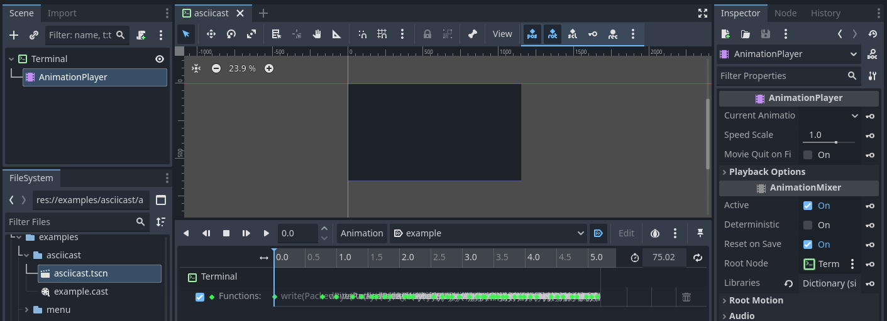
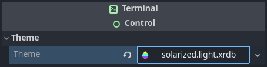

# Import plugins

GodotXterm includes custom import plugins that automatically handle specific file formats commonly used with terminals. These plugins integrate with Godot's import system to convert external files into native Godot resources that can be used directly in your project.

## Asciicast

[Asciinema](https://asciinema.org/) is a terminal session recorder that creates lightweight, text-based recordings of terminal sessions. Instead of video files, it produces JSON-based recordings that capture the exact terminal output and timing.

The Asciinema import plugin allows you to import asciicast recording files (`.cast` files) as Godot {{ '[Animation]({}/classes/class_animation.html)'.format(godot_docs) }} resources. You can download example recordings from [asciinema.org](https://asciinema.org/explore) or create your own using the `asciinema rec` command.

To use asciicast files in your Godot project:

1. Copy any `.cast` file into your project directory.
2. Add a [Terminal](/classes/class_terminal.rst) node and {{ '[AnimationPlayer]({}/classes/class_animationplayer.html)'.format(godot_docs) }} to your scene, setting the AnimationPlayer's root node to the Terminal (default if the AnimationPlayer is added as a child of Terminal).
3. In the AnimationPlayer's libraries, add the imported `.cast` file as an animation.
4. The animation will call the Terminal's `write()` method with the recorded terminal output and timing.

## X resources

[X resources](https://wiki.archlinux.org/title/X_resources) is a configuration system used by X11 applications, particularly terminal emulators, to define colors, fonts, and other appearance settings. The X resources import plugin automatically converts X resource files (`.xrdb`, `.Xresources`, `.xresources`) into Godot {{ '[Theme]({}/classes/class_theme.html)'.format(godot_docs) }} resources. Once imported, these resources can be applied to the Terminal node's **Theme** property in the inspector.

Popular sources for Xresources color schemes:

- **[terminal.sexy](https://terminal.sexy/)** - Terminal color scheme designer.
- **[janoamaral/Xresources-themes](https://github.com/janoamaral/Xresources-themes)** - Collection of terminal color schemes.
