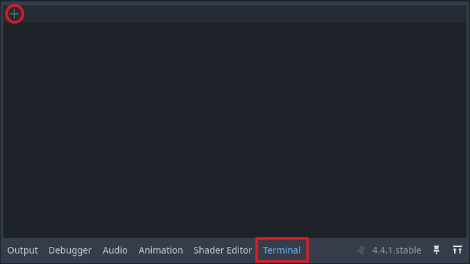
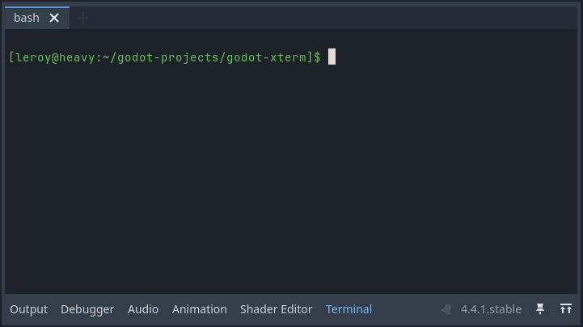
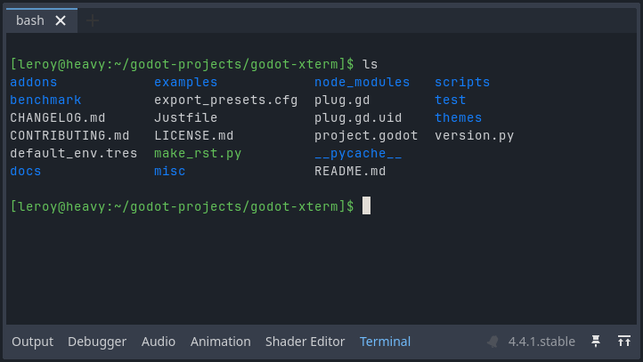

# Integrated terminal

The integrated terminal provides a built-in terminal panel in the Godot Editor, similar to VSCode's integrated terminal or IntelliJ's embedded terminal. This allows you to run shell commands, build scripts, version control operations, and other terminal tasks without leaving the editor.

:::{warning}
The integrated terminal currently has limited options for customization.
Enterprising users may wish to edit the files under `addons/godot_xterm/editor_plugins/` until more advanced customization features become available.
:::

## Getting started

First, ensure that the plugin has been enabled in the plugin menu. See [Enable the plugin](/getting_started/installation.md#enable-the-plugin) for more details.

1. Open the terminal panel by clicking the "Terminal" button in the bottom panel of the Godot Editor.

2. In the terminal panel, press the "New Terminal" button (which looks like a plus symbol).

   

   :::{tip}
   A new terminal can also be opened with the keyboard shortcut {kbd}`Ctrl + Shift + T`.
   This shortcut will open the terminal panel in addition to creating a new terminal tab.
   See the [Keyboard shortcuts](#keyboard-shortcuts) section for a full list of default shortcuts.
   :::

3. The terminal will open a shell based on your operating system and configuration.
   It will check for the value of `SHELL` in environment variables first.
   If it cannot find one, the terminal opens with a default shell like Bash, PowerShell, or Zsh.
   The shell's working directory will be the Godot project's root (i.e., {code}`res://`).

   

   :::{tip}
   To get a Bash shell on Windows, you can launch the Godot editor via Git Bash, which will set the appropriate `SHELL` environment variable.
   :::

4. Enter a basic command like `ls`, which lists files and directories in the current working directory.

   

## Theme

The integrated terminal inherits the editor's code font and font size settings.

The integrated terminal automatically uses colors from your Godot Editor's text editor theme. It maps syntax highlighting colors from **Editor > Editor Settings > Text Editor > Theme** to terminal colors, so changing your editor theme will also change the terminal's appearance.

## Keyboard shortcuts

The integrated terminal supports several keyboard shortcuts:

| Shortcut                | Action                     |
| ----------------------- | -------------------------- |
| {kbd}`Ctrl + Shift + T` | Open new terminal tab      |
| {kbd}`Ctrl + Shift + X` | Close current terminal tab |
| {kbd}`Ctrl + Shift + C` | Copy selected text         |
| {kbd}`Ctrl + Shift + V` | Paste from clipboard       |
| {kbd}`Ctrl + PageUp`    | Switch to previous tab     |
| {kbd}`Ctrl + PageDown`  | Switch to next tab         |
